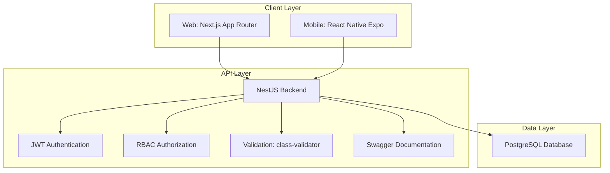
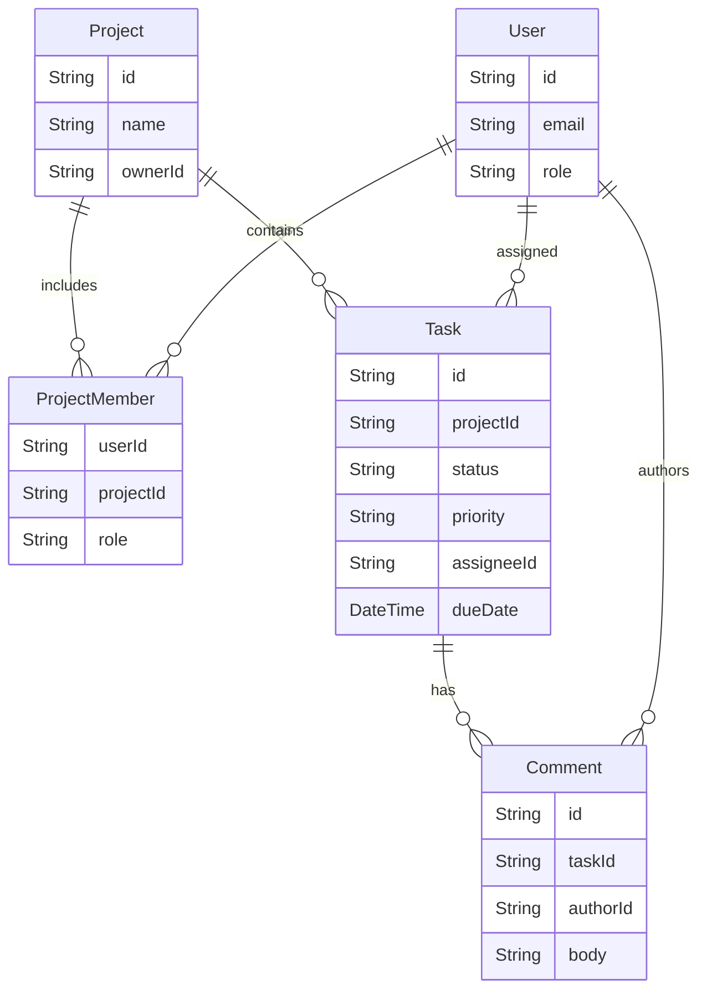

# TeamSync Architecture & Technical Spec

This document summarizes the architecture, database design, security model, and deployment strategy for TeamSync. It covers Parts D and E of the CDAZZDEV engineering assessment.

## 1. System Overview

TeamSync uses a modular three-tier architecture designed for clarity, maintainability, and future growth.



## 2. Technology Choices

### Backend

- NestJS
- TypeScript
- Prisma ORM
- JWT authentication
- Role-based access control

### Database

- PostgreSQL

### Web Client

- Next.js
- React
- TypeScript

### Mobile Client

- Expo
- React Native

### Containerization

- Docker
- Docker Compose

## 3. Authentication Flow

1. The user submits credentials.
2. The backend validates the request.
3. The password hash is verified.
4. A JWT access token is issued.
5. The client stores the token securely.
6. Protected endpoints validate the token.
7. RBAC guards enforce permissions.

## 4. Security Measures

### Password Security

- Passwords are hashed using bcrypt.
- Plain-text passwords are never stored.

### Authentication

- JWT access tokens are used for session state.
- Route guards protect private endpoints.

### Authorization

- Global roles.
- Project-level roles.
- RBAC enforced at the API layer.

### Validation

- DTO validation.
- Request sanitization.
- Strong typing through TypeScript.

## Part D: Database Design

The schema is normalized to support strict RBAC both globally and within each project.

### Entity Relationship Diagram (ERD)



### Indexing Strategy (At 1M+ Rows)

When a database table scales to 1,000,000+ rows, relying on sequential table scans for complex queries becomes a severe performance bottleneck. For the Task table, where queries frequently filter by `projectId`, `status`, and `assigneeId`, and subsequently sort by `dueDate`, a carefully constructed composite B-tree index is absolutely essential.

I would implement a composite index utilizing all four of these columns. Database query planners evaluate composite indexes based on the "leftmost prefix" rule, meaning column order is critical to ensuring the index is utilized properly.

- `projectId` (Highly Restrictive): This must be the leading column in the index. Since users almost exclusively view tasks scoped to a single project board, filtering by `projectId` immediately eliminates the vast majority of the 1M+ rows from the scan.
- `status` and `assigneeId` (Secondary Filters): Placing these next allows the database engine to further narrow down the remaining project-specific subset rapidly.
- `dueDate` (The Sort Key): Placing the sorted column at the exact end of the composite index is a crucial optimization. Because the index perfectly matches the WHERE clauses, the database can use the index's inherent B-tree structure to return the filtered results already ordered. Without this, the database is forced to perform a costly in-memory sort (a filesort) on the filtered dataset, which severely degrades performance under heavy load.

While adding indexes incurs a slight write penalty during INSERT or UPDATE operations, the massive read-speed improvements for dashboard rendering make this trade-off highly favorable.

In `schema.prisma`, the annotation would be applied directly to the Task model:

```prisma
@@index([projectId, status, assigneeId, dueDate])
```

## Part E: Cloud Architecture

TeamSync runs locally with Docker Compose for the assessment, but the production strategy is AWS-based.

### 1. Component Infrastructure

- **Backend API (NestJS):** Deployed to Amazon ECS using AWS Fargate. This removes the need to manage EC2 instances while allowing horizontal scaling based on CPU and memory thresholds.
- **Database (PostgreSQL):** Hosted on Amazon Aurora Serverless v2 (PostgreSQL-compatible). Aurora scales capacity up and down automatically, which fits a B2B workload with predictable peaks and quieter off-hours.
- **Web Client (Next.js):** Deployed with AWS Amplify Hosting. It supports Next.js App Router, Server Actions, SSR, and CloudFront-backed CDN delivery.
- **Mobile Client (React Native):** Built and distributed using Expo Application Services (EAS) for CI/CD to iOS TestFlight and Google Play internal testing.

### 2. Secrets Management

Production secrets such as `DATABASE_URL` and `JWT_SECRET` must never live in source code or CI logs. They would be stored in AWS Secrets Manager and injected into the ECS task definition at runtime as environment variables.

### 3. CI/CD Pipeline Sketch

Continuous integration and deployment are handled through GitHub Actions:

1. **Test stage on pull requests:** Runs `npm run lint`, Jest unit tests, and Prisma schema formatting checks.
2. **Build stage on merge to main:** Builds the Next.js production app, builds the NestJS Docker image, and pushes it to Amazon ECR.
3. **Deploy stage:** Triggers an ECS rolling update for the API and an AWS Amplify webhook for the web app.

### 4. Scaling Concerns and Mitigation

**Bottleneck:** As teams grow, requests to `/projects/:id/tasks` become increasingly read-heavy and may overload the primary Aurora writer.

**Mitigation:**

1. Add Amazon ElastiCache (Redis) in front of the NestJS API to cache project boards with short TTLs.
2. Provision Aurora read replicas and route read-only Prisma queries to the replica endpoints so the primary database stays focused on writes.

## 5. Key Engineering and Security Decisions

### Web Authentication

Instead of storing JWTs in `localStorage`, the Next.js client uses Server Actions to set `httpOnly`, `Secure` cookies. Middleware then protects routes based on cookie presence.

### Mobile Authentication

React Native cannot use `httpOnly` cookies, so tokens are stored with `expo-secure-store`. This encrypts the JWT and stores it in the iOS Keychain and Android Keystore. Plain `AsyncStorage` is not used for authentication credentials.

### Mobile Offline-First Architecture

The React Native app uses `@react-native-async-storage/async-storage` as a local cache. Network connectivity is monitored, and when the device goes offline the app falls back to cached data and shows a visible offline banner.

### Optimistic UI Updates

Task comments use an optimistic UI flow. New comments appear immediately with a temporary ID before the API response arrives. If the server returns an error, the UI rolls back the state and alerts the user.

### Expo Go Limitation

Push notification registration is included in `mobile/App.tsx`, but it is wrapped in a safe `try/catch` for Expo Go compatibility. Since Expo Go does not support remote push notification registration in this assessment setup, the app remains stable in local Expo Go while still supporting standalone or custom development builds.

## 6. Design Decisions

### Why NestJS?

- Modular architecture
- Built-in dependency injection
- Strong TypeScript support
- Enterprise-ready patterns

### Why PostgreSQL?

- ACID compliance
- Strong relational modeling
- Excellent Prisma support

### Why Docker?

- Consistent environments
- Easy onboarding
- Reproducible deployments

### Why RBAC?

- Fine-grained permissions
- Clear separation of responsibilities
- Supports future growth of teams and projects

### Tooling & Ecosystem Navigation (The ESM Trap)

During backend initialization, a strategic decision was made regarding Prisma ORM versioning. Prisma 7 recently transitioned to a completely Rust-free, ESM-only (ECMAScript Modules) architecture. Because the standard NestJS boilerplate utilizes CommonJS, forcing Prisma 7 into this setup introduces an endless loop of ERR_REQUIRE_ESM import errors. Furthermore, the vast majority of ecosystem context and debugging resources are built for Prisma 5/6. To prioritize predictable execution and battle-tested stability over bleeding-edge features during a tight deadline, a stable, CommonJS-compatible version of Prisma was selected.

## 7. Deployment Strategy

### Development

```text
Docker Compose
├─ PostgreSQL
└─ NestJS API
```

### Production

```text
Load Balancer
      │
      ▼
NestJS Containers
      │
      ▼
PostgreSQL Database
```

This approach provides a clear path from local development to production infrastructure without major architectural changes.
